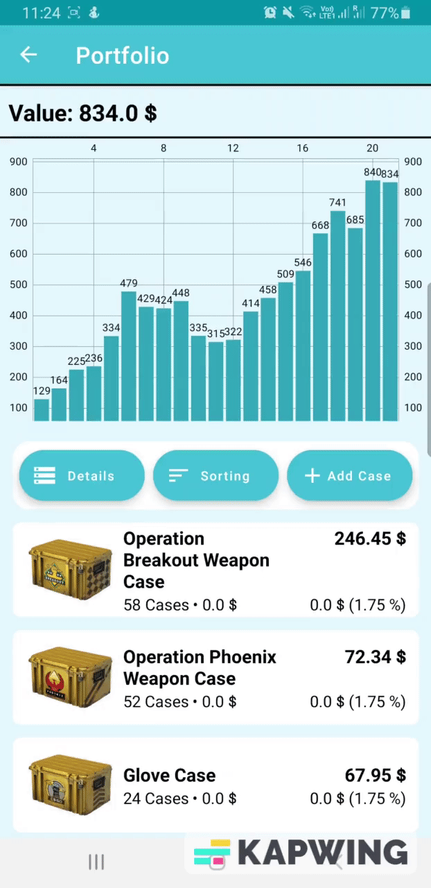

# CS:GO Case Portfolio Tracker
This is an app that allows you to track your CSGO Case Portfolio (cases you have collected or bought), track their price movement, return, and see how many cases you have and their total value. With this app you will be able to:

## Overview data about games cases:

- Current market volume, lowest and mid price of the cases
- Main information about the case(description of the case, release date and drop status)

  

- Investing data (Monthly and daily average return, standard deviation and sharp ratio)

 

https://user-images.githubusercontent.com/70269178/190982590-6d9dba01-27eb-4f85-ba23-f5e9453c64e3.mp4

## Track your investments:

- Add cases to your portfolio

 

https://user-images.githubusercontent.com/70269178/190982692-c8fdd39b-4128-404f-9479-a8ba0c83de7a.mp4

- View investment data about the cases (number of cases in portfolio, their average purchase price, total value and currency profit (or loss)

https://user-images.githubusercontent.com/70269178/190982859-84933cd4-bcff-41bf-90e9-565a6649b4b1.mp4

- View your hisorical Portfolio Value and sort portfolio (by name, number of cases, average purchase price, overall value and by profit/loss)

 

https://user-images.githubusercontent.com/70269178/190984771-4a36d38c-4d72-4fdf-81d2-4793948fef85.mp4

## Backend

For this App I created a my own server using Ktor. [CSGO Case Portfolio Tracker Backend](https://github.com/ilya-shevtsov/CSGOCasesWatcherAppServer)
